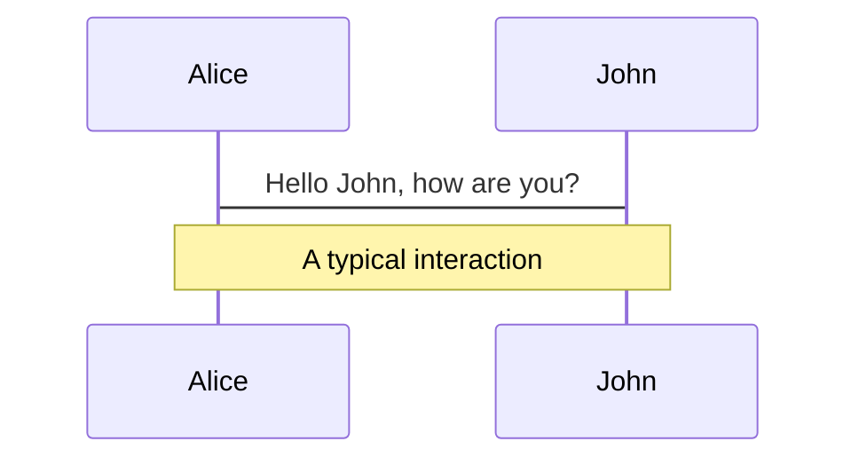
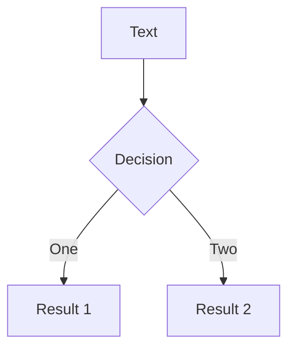
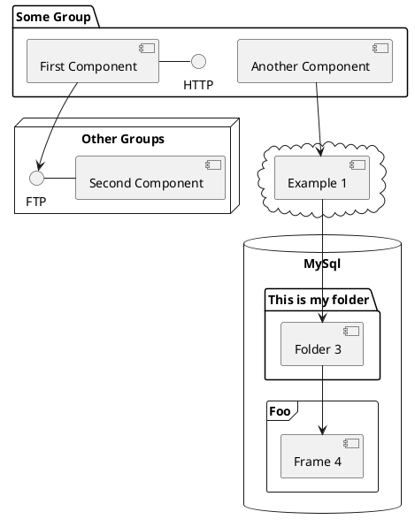

---
# try also 'default' to start simple
theme: seriph
# random image from a curated Unsplash collection by Anthony
# like them? see https://unsplash.com/collections/94734566/slidev
background: https://source.unsplash.com/collection/94734566/1920x1080
# apply any windi css classes to the current slide
class: 'text-center'
# https://sli.dev/custom/highlighters.html
highlighter: shiki
# show line numbers in code blocks
lineNumbers: false
# some information about the slides, markdown enabled
info: |
  ## Slidev Starter Template
  Presentation slides for developers.

  Learn more at [Sli.dev](https://sli.dev)
# persist drawings in exports and build
drawings:
  persist: false
# page transition
transition: slide-left
# use UnoCSS
css: unocss
---

# 数字图像处理

谭润泉 x ChatGPT

---
transition: fade-out
---

# 资料索引


# 什么是数字图像处理

<br>
<br>

- **数字图像** - 定义为二维函数 f(x,y),在 (x,y) 处幅值 f 为图像在该点的灰度值的一幅图像
- **数字图像处理** - 借助计算机进行数字图像的处理

<br>
<br>
<div class="image-container h-60 flex items-center justify-around">


</div>

<style>
h1 {
  background-color: #2B90B6;
  background-image: linear-gradient(45deg, #4EC5D4 10%, #146b8c 20%);
  background-size: 100%;
  -webkit-background-clip: text;
  -moz-background-clip: text;
  -webkit-text-fill-color: transparent;
  -moz-text-fill-color: transparent;
}
</style>

---
transition: slide-up
---

# 图像处理能做什么

图像处理的常用应用领域


---

# 图像处理的技术层次

<br/>
<br/>
<br/>
<div grid="~ cols-2 gap-4" v-click-hide>

- **图像处理** - 泛指各种图像技术，狭义指对图像进行各种加工以改善视觉效果，并为自动识别打基础。

<br/>

- **图像分析** -对图像中感兴趣的目标进行检测和测量，以获得它们的客观信息，从而建立对图像的描述。

<br/>

- **图像理解** - 进一步研究图像中各目标的性质和它们之间的联系，并得出对图像内容的理解及对原来客观场景的解释。


</div>


<style>
 .slidev-vclick-target {
  transition: all 500ms ease;
}
.first {
  .slidev-vclick-hidden {
    transition: all 500ms ease;
  } 
}
</style>

---

# 图像空域处理

它基于图像中每个像素的数值进行操作。具体来说，空域处理使用图像中每个像素周围的像素值来计算新的像素值，以实现各种图像增强、滤波、锐化和模糊等操作。这种处理方法是最常用和最简单的图像处理方法之一。


- 算术运算（代数运算）- 加、减、乘、除
- 逻辑运算 - 与、或、非、异或
- 几何变换 - 平移、缩放、剪切、旋转
- 点运算（灰度变换）：线性、非线性、映射
- 直方图变换 - 直方图均衡化、直方图规定化
- 空域滤波 - 空域卷积

---

# 数学

**为什么要使用矩阵**

图像处理中使用矩阵的主要原因是，数字图像可以看作是一个由像素值构成的二维矩阵或三维矩阵（对于彩色图像）。在这种情况下，许多图像处理操作都可以用矩阵运算来表示和实现，这样可以利用高效的矩阵算法来处理图像，从而加快计算速度。例如，在空域处理中，常用的滤波器和卷积操作都可以用矩阵乘法来表示，而在频域处理中，傅里叶变换和滤波器等操作也可以用矩阵运算来实现。因此，使用矩阵可以使图像处理更加高效、灵活和方便。

**齐次坐标**

什么是齐次坐标：齐次坐标就是用 N+1 维来代表 N 维坐标

将二维的点表示为三维的形式，方便进行矩阵运算

---

# 算术运算 - 加法

$g(x,y) = a(x,y) + b(x,y)$
---
## 应用

- 图像融合
- 增强/减弱亮度
- 消除噪声


# 算术运算 - 减法

## 应用

- 增强/减弱亮度
- 运动检测

---

# 算术运算 - 乘法

## 应用

- 增强/减弱亮度
- 图像掩模

---

# 算术运算 - 除法

## 应用

- 增强/减弱亮度
- 非均匀场景位置确定

---

# 逻辑运算 - 与

## 应用

- 获取图像的相交子图像

---

# 逻辑运算 - 或

---

# 逻辑运算 - 非

## 应用

- 获得图像的负像
- 获得图像的补图像

---

# 逻辑运算 - 异或

## 应用

- 获取图像的相交子图像

---

# 逻辑运算-Canvas


---


# 几何变换 - 平移

---

# 几何变换 - 缩放

---

# 几何变换 - 剪切

---

# 几何变换 - 旋转

---

# 几何变换-CSS


---

# 点运算 - 线性和非线性

线性：指两个变量间遵循线性关系，一个变量变化对另一个变量的影响是固定的，一般形式表现为 y = ax + b
非线性：指一个变量变化对另一个变量的影响是非固定的，二次函数、指数函数等

在图像处理中通常描述图像处理算法的输入和输出之间的关系

---

# 点运算 - 线性运算

---

# 点运算 - 非线性运算

---

# 点运算 - 映射

---

# 直方图变换 - 均衡化

---

# 直方图变换 - 规定化

---


# 空域滤波 - 空域卷积

---


# 数字图像的空域处理

Use code snippets and get the highlighting directly![^1]
<!-- |分割点击步骤，各个步骤分别高亮哪块代码 -->
```ts {all|2|1-6|9|all}
interface User {
  id: number
  firstName: string
  lastName: string
  role: string
}

function updateUser(id: number, update: User) {
  const user = getUser(id)
  const newUser = { ...user, ...update }
  saveUser(id, newUser)
}
```
<!-- v-click="3"等于 3 后显示 -->
<arrow v-click="3" x1="400" y1="420" x2="230" y2="330" color="#564" width="3" arrowSize="1" />
<!-- ^1 索引 -->
[^1]: [Learn More](https://sli.dev/guide/syntax.html#line-highlighting)

<style>
.footnotes-sep {
  @apply mt-20 opacity-10;
}
.footnotes {
  @apply text-sm opacity-75;
}
.footnote-backref {
  display: none;
}
</style>

---

# Components

<div grid="~ cols-2 gap-4">
<div>

You can use Vue components directly inside your slides.

We have provided a few built-in components like `<Tweet/>` and `<Youtube/>` that you can use directly. And adding your custom components is also super easy.

```html
<Counter :count="10" />
```

<!-- ./components/Counter.vue -->
<Counter :count="10" m="t-4" />

Check out [the guides](https://sli.dev/builtin/components.html) for more.

</div>
<div>

```html
<Tweet id="1390115482657726468" />
```

<Tweet id="1390115482657726468" scale="0.65" />

</div>
</div>

<!--
Presenter note with **bold**, *italic*, and ~~striked~~ text.

Also, HTML elements are valid:
<div class="flex w-full">
  <span style="flex-grow: 1;">Left content</span>
  <span>Right content</span>
</div>
-->


---
class: px-20
---

# Themes

Slidev comes with powerful theming support. Themes can provide styles, layouts, components, or even configurations for tools. Switching between themes by just **one edit** in your frontmatter:

<div grid="~ cols-2 gap-2" m="-t-2">

```yaml
---
theme: default
---
```

```yaml
---
theme: seriph
---
```


</div>

Read more about [How to use a theme](https://sli.dev/themes/use.html) and
check out the [Awesome Themes Gallery](https://sli.dev/themes/gallery.html).

---
preload: false
---

# Animations

Animations are powered by [@vueuse/motion](https://motion.vueuse.org/).

```html
<div
  v-motion
  :initial="{ x: -80 }"
  :enter="{ x: 0 }">
  Slidev
</div>
```

<div class="w-60 relative mt-6">
  <div class="relative w-40 h-40">
    
    
    
  </div>

  <div
    class="text-5xl absolute top-14 left-40 text-[#2B90B6] -z-1"
    v-motion
    :initial="{ x: -80, opacity: 0}"
    :enter="{ x: 0, opacity: 1, transition: { delay: 2000, duration: 1000 } }">
    Slidev
  </div>
</div>

<!-- vue script setup scripts can be directly used in markdown, and will only affects current page -->
<script setup lang="ts">
const final = {
  x: 0,
  y: 0,
  rotate: 0,
  scale: 1,
  transition: {
    type: 'spring',
    damping: 10,
    stiffness: 20,
    mass: 2
  }
}
</script>

<div
  v-motion
  :initial="{ x:35, y: 40, opacity: 0}"
  :enter="{ y: 0, opacity: 1, transition: { delay: 3500 } }">

[Learn More](https://sli.dev/guide/animations.html#motion)

</div>

---

# LaTeX

LaTeX is supported out-of-box powered by [KaTeX](https://katex.org/).

<br>

Inline $\sqrt{3x-1}+(1+x)^2$

Block
$$
\begin{array}{c}

\nabla \times \vec{\mathbf{B}} -\, \frac1c\, \frac{\partial\vec{\mathbf{E}}}{\partial t} &
= \frac{4\pi}{c}\vec{\mathbf{j}}    \nabla \cdot \vec{\mathbf{E}} & = 4 \pi \rho \\

\nabla \times \vec{\mathbf{E}}\, +\, \frac1c\, \frac{\partial\vec{\mathbf{B}}}{\partial t} & = \vec{\mathbf{0}} \\

\nabla \cdot \vec{\mathbf{B}} & = 0

\end{array}
$$

<br>

[Learn more](https://sli.dev/guide/syntax#latex)

---

# Diagrams

You can create diagrams / graphs from textual descriptions, directly in your Markdown.

<div class="grid grid-cols-3 gap-10 pt-4 -mb-6">







</div>

[Learn More](https://sli.dev/guide/syntax.html#diagrams)

---
src: ./pages/multiple-entries.md
hide: false
---

---
layout: center
class: text-center
---

# Learn More

[Documentations](https://sli.dev) · [GitHub](https://github.com/slidevjs/slidev) · [Showcases](https://sli.dev/showcases.html)
